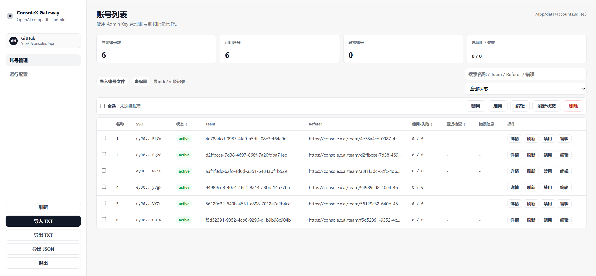
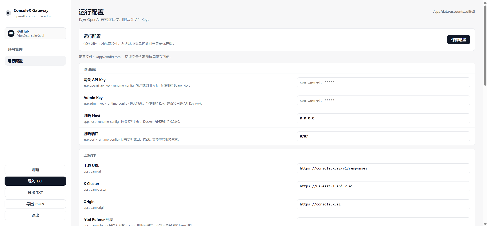
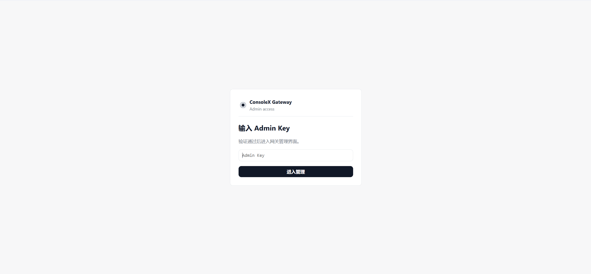

<h1 align="center">ConsoleX2API</h1>

<p align="center">
  <b>A lightweight OpenAI-compatible gateway for console.x.ai</b>
</p>

<p align="center">
  <a href="./README.md">中文</a> ·
  <a href="#preview">Preview</a> ·
  <a href="#quick-start">Quick Start</a> ·
  <a href="#docker-compose">Docker Compose</a> ·
  <a href="#docker">Docker</a> ·
  <a href="#configuration">Configuration</a>
</p>

<p align="center">
  
  
  
  
</p>

---

## Overview

ConsoleX2API wraps `console.x.ai` as an OpenAI-compatible gateway. It proxies upstream Responses and Realtime Voice capabilities into common OpenAI-style endpoints, while keeping account management, runtime configuration, streaming, and request adaptation inside one small service.

The Chinese README is the primary documentation. This file is a concise English version for deployment and integration.

## Features

| Feature | Status | Notes |
| --- | --- | --- |
| Models | Supported | `GET /v1/models` |
| Chat Completions | Supported | `POST /v1/chat/completions`, streaming and non-streaming |
| Responses | Supported | `POST /v1/responses` |
| Image input | Supported | Chat `image_url` is converted to Responses `input_image` |
| Tools control | Supported | Admin UI can enable or disable `web_search` and `x_search` separately |
| Reasoning effort | Supported | Default reasoning effort applies only to `grok-4.3` |
| Realtime Voice | Supported | client secret + WebSocket passthrough |
| Account pool | Supported | SQLite-backed SSO accounts with per-account `team_id` |
| Admin UI | Supported | Login page, account management, runtime settings |
| Docker | Supported | Dockerfile and Docker Compose |

This project does not provide `/v1/images/*` or `/v1/videos/*` generation/editing endpoints. Image support means image input in Chat/Responses requests.

## Preview

| Account Management | Runtime Settings | Login |
| --- | --- | --- |
|  |  |  |

## Quick Start

### 1. Clone

```bash
git clone https://github.com/YforC/consolex2api.git
cd consolex2api
```

### 2. Install dependencies

```bash
python -m pip install fastapi uvicorn curl_cffi pydantic websockets
```

### 3. Configure

```bash
cp .env.example .env
```

Minimum configuration:

```env
OPENAI_API_KEY=replace-with-your-gateway-key
ADMIN_KEY=replace-with-your-admin-key
ACCOUNTS_DB=accounts.sqlite3
GATEWAY_HOST=0.0.0.0
GATEWAY_PORT=8787
```

Do not hard-code one global team ID in `.env`. Import accounts through the admin UI using one `sso,teamid` pair per line.

### 4. Run

```bash
python -m app
```

Admin UI:

```txt
http://127.0.0.1:8787/admin
```

## Account Import

TXT import format:

```txt
sso-token-1,team-id-1
sso-token-2,team-id-2
sso=token-3,team-id-3
```

Imported accounts are named `1`, `2`, `3`, and start as `active`.

## Docker Compose

### 1. Clone

```bash
git clone https://github.com/YforC/consolex2api.git
cd consolex2api
```

### 2. Configure

```bash
cp .env.example .env
```

Recommended container settings:

```env
OPENAI_API_KEY=replace-with-your-gateway-key
ADMIN_KEY=replace-with-your-admin-key
ACCOUNTS_DB=/app/data/accounts.sqlite3
GATEWAY_PORT=8787
```

### 3. Start

```bash
docker compose up -d --build
```

### 4. Logs

```bash
docker compose logs -f
```

### 5. Stop and remove

```bash
docker compose down
```

To remove local persisted account data, delete `./data/`.

## Docker

### 1. Clone

```bash
git clone https://github.com/YforC/consolex2api.git
cd consolex2api
```

### 2. Configure

```bash
cp .env.example .env
```

### 3. Build

```bash
docker build -t consolex2api .
```

### 4. Run

```bash
docker run -d \
  --name consolex-gateway \
  --restart unless-stopped \
  -p 8787:8787 \
  --env-file .env \
  -e ACCOUNTS_DB=/app/data/accounts.sqlite3 \
  -v "$(pwd)/data:/app/data" \
  consolex2api
```

### 5. Stop and remove

```bash
docker stop consolex-gateway
docker rm consolex-gateway
```

To remove local persisted account data, delete `./data/`.

## API

Use `OPENAI_API_KEY` for `/v1/*` endpoints and `ADMIN_KEY` for `/admin`.

```bash
curl http://127.0.0.1:8787/v1/models \
  -H "Authorization: Bearer $OPENAI_API_KEY"
```

Chat Completions:

```bash
curl http://127.0.0.1:8787/v1/chat/completions \
  -H "Authorization: Bearer $OPENAI_API_KEY" \
  -H "Content-Type: application/json" \
  -d '{
    "model": "grok-4.3",
    "stream": true,
    "messages": [
      {"role": "user", "content": "say pong"}
    ]
  }'
```

## Configuration

Runtime settings saved from the admin UI are written to `config.toml` and take precedence over `.env` and container environment variables for gateway runtime behavior. API keys, proxy settings, model list, tools, and generation defaults take effect on subsequent requests.

Host and port are also saved to `config.toml`, but changing the active listening address requires restarting the service or container.

| Variable | Description |
| --- | --- |
| `OPENAI_API_KEY` | Bearer key for `/v1/*` endpoints |
| `ADMIN_KEY` | Key for admin UI login |
| `GATEWAY_HOST` | Listen host, default `0.0.0.0` |
| `GATEWAY_PORT` | Listen port, default `8787` |
| `ACCOUNTS_DB` | SQLite account database path |
| `UPSTREAM_PROXY` | Optional upstream proxy |
| `GATEWAY_WEB_SEARCH_ENABLED` | Allow `web_search` |
| `GATEWAY_X_SEARCH_ENABLED` | Allow `x_search` |
| `DEFAULT_REASONING_EFFORT` | Default reasoning effort for `grok-4.3` |
| `GATEWAY_MODELS` | Optional model list override |

## Security Notes

- Do not commit `.env`, SQLite databases, cookies, or HAR files.
- Use different values for `OPENAI_API_KEY` and `ADMIN_KEY`.
- For public deployment, put the service behind a reverse proxy with TLS and access controls.

## Disclaimer

This project is intended for personal learning, API adaptation, and account management. Use it responsibly and follow the terms of the upstream service.
